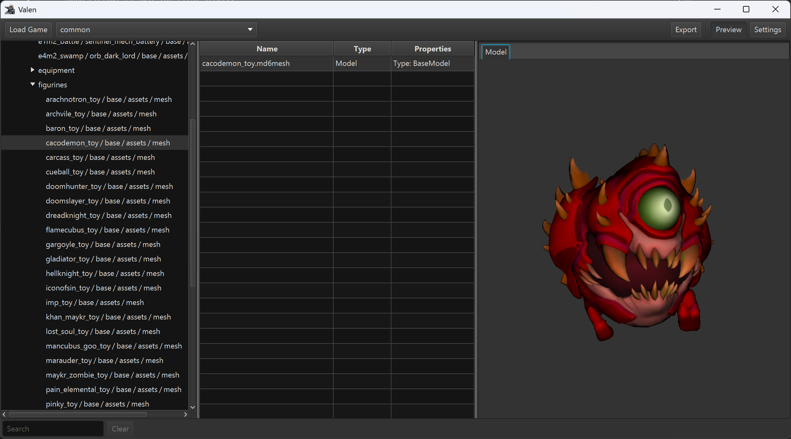

# Valen

## Introduction

Another one of those "I'm bored, let's see what we can do" projects.

As a big fan of DOOM Eternal, I wanted to see if I could read a couple of files here and there, just to see what's up.
It appears there are already a couple of tools like that, but I wanted to do it for myself. See what I can find...

What happened next was a classic case of scope creep. This project basically taught me reverse engineering properly; I
learned how game engines work, how video games are generally constructed, and much more.

So after some abstractions and wild ideas here and there, a simple extractor turned into a game extraction framework.
DOOM Eternal is just the first step...

## What does it do?

Right now, most of what is needed for general game support is available.

* A general UI to select a game and a subsection (maps, archives, etc.)
* A file browser, with search functionality and filtering between different types
* Bulk export functionality
* Abstractions for textures, models, materials, skeletons, animations...
* Exporting to several different formats
    * Textures: DDS (including all mipmaps) and PNG (with "blue" normals)
    * Models: GLTF, either split or in a single GLB file
    * Materials: GLTF, applied to a UV sphere.
        * Currently support for Albedo, Normal, Specular, Smoothness, and Emissive
        * Either by using maps or factors (or both)
    * Skeletons: GLTF nodes, and automatically exported when the model is animated
    * Animations: GLTF exported separately, including the skeleton so they can be merged in Blender
    * Raw files: Exported as is
* Previews for the following types
    * Textures: Channel selection, with auto-detection of non-premultiplied alpha
    * Models: 3d preview with albedo applied
  * Raw files: Binary as hex, auto-analyzed to text, with support for huge files

## Why

Why not? I've always been interested in how things tick. After a day of writing business logic, I enjoy stretching
different skills through this project. The original goal, which is still relevant today, is to document
the formats of every supported game. I believe this information should be publicly available for modding communities to
take advantage of, or general tinkering...

The goal is to document the file formats that are used in the games and provide a way to read them. Meanwhile, I've
written templates for all formats, so you can do with this information whatever you want.

Full compatibility is pretty much guaranteed. If it can read a file, I mean all files of that type. With no exceptions.
If there are any, those are bugs.

## Game Support

For now a bit terse, but you have to start somewhere

| Game                               | Textures | Materials | Models        | Skeletons | Animations | Hair |
|------------------------------------|----------|-----------|---------------|-----------|------------|------|
| DOOM Eternal                       | Yes      | Yes       | Yes           | Yes       | Yes        | ---  |
| Indiana Jones and the Great Circle | Yes      | Yes       | Partial (3/4) | Yes       | No         | Yes  |
| DOOM: The Dark Ages                | Yes      | Yes       | Yes           | Yes       | Yes        | Yes  |

### Planned:

* Wolfenstein 2: New Colossus
* Source 1 Games (Half-Life 2, Team Fortress 2, ...)
* ... (check the branches under `games`)

## (Not) Invented Here

Having a bad habit of not being satisfied with existing libraries, and for some functionality, there's even a complete
absence of any existing libraries, so there are a few custom implementations in here.

* BCn decoder — currently spun off in a separate project [TinyBCDec](https://github.com/jandk/tinybcdec/)
* PNG exporter — the Java built-in still has the adaptive filtering bug for non-paletted images...
    * That, and it's written in Java itself, so there's no loss here, and I have more control
* GLTF exporter — Unlike dotnet, there's only a very confusing library available for GLTF the last time I checked,
  needs to be spun off into its own project as well
* CAST exporter — There wasn't any available for Java yet, so I made one. Planning on releasing it separately if I get
  around to fixing the codegen. Still needs validation etc.
* There are some others planned...

## Todo

So. Much. Todo...

* World export. The code is there, but the export itself is still lacking
* Improve the exporter — It needs work, but it's _good enough_ for now
* Support more games, obviously
* EXR support for textures, because PNG is not enough for half/float textures
* Eventually a proper OpenGL renderer (for animations!)
* Nearest neighbor filtering for texture viewer
* Generic JSON-like data structure, more as a helping hand. And a little UI for it as well.

## Credits

* SamPT ([@brongo](https://github.com/brongo/)) - He did most of the leg work, and inspired me to dig in
* Shadeless ([@ShadelessFox](https://github.com/ShadelessFox)) and RED_EYE ([@REDxEYE](https://github.com/REDxEYE)) as
  my partners in crime haha
* [Doom Eternal Modding Discord](https://discord.gg/6yvZs2U) - For being a great community.
* XeNTaX Discord - For being a bunch of like-minded crazies
